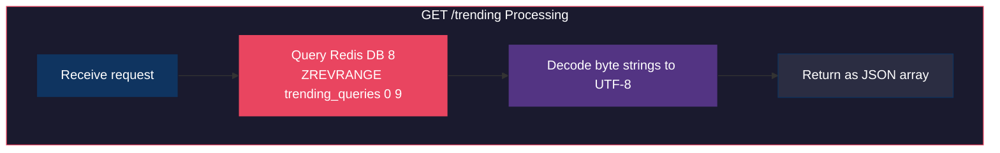
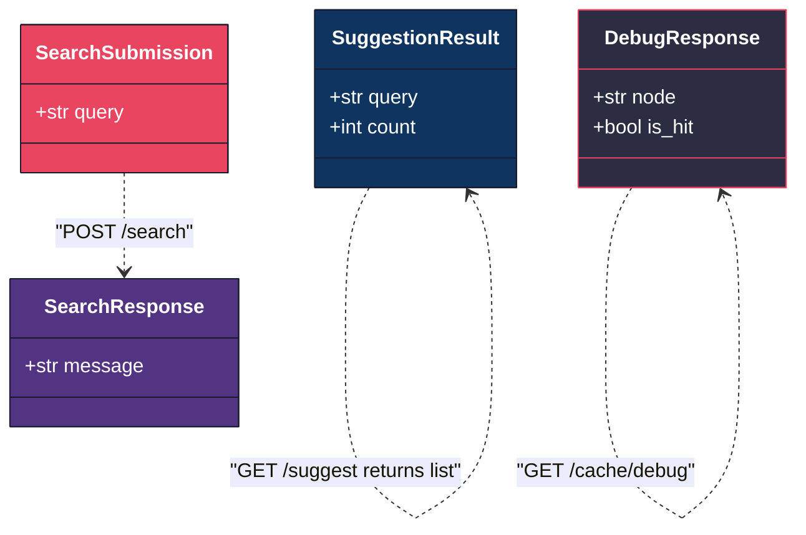

# TypeMAX  API Documentation

---

## 1. Base URL

```
http://localhost:8765
```

All endpoints are served by the FastAPI application defined in `server_routing.py`.

---

## 2. Endpoint Summary

| Method | Path | Purpose | Auth |
|--------|------|---------|------|
| `GET` | `/suggest` | Fetch prefix-matched suggestions | None |
| `POST` | `/search` | Submit a search query | None |
| `GET` | `/cache/debug` | Inspect cache state for a prefix | None |
| `GET` | `/trending` | Fetch currently trending queries | None |

---

## 3. Detailed Endpoint Reference

---

### 3.1 GET /suggest

Returns up to 10 autocomplete suggestions matching the given prefix, sorted by a trending-weighted score (blending all-time count with recent search activity).

#### Request

| Parameter | Location | Type | Required | Description |
|-----------|----------|------|----------|-------------|
| `q` | Query string | `string` | Yes | The prefix to autocomplete. Empty string returns `[]`. |

#### Flow

```mermaid
graph TD
    subgraph SUGGEST_FLOW["GET /suggest Processing"]
        style SUGGEST_FLOW fill:#1a1a2e,stroke:#e94560,color:#fff

        A["Receive q parameter"] --> B{"q is empty--}
        B -->|"Yes"| C["Return empty array"]
        B -->|"No"| D["Compute hash node<br/>consistent_hashing.get_assigned_node(q)"]
        D --> E["Check Redis cache<br/>redis_manager.get_cached_suggestions"]
        E --> F{"Cache hit--}
        F -->|"Yes"| G["Return cached results"]
        F -->|"No"| H["Query PostgreSQL<br/>LIKE prefix% ORDER BY count DESC LIMIT 50"]
        H --> I["Apply trending re-rank<br/>trending_calculator.calculate_trending_suggestions"]
        I --> J["Slice top 10"]
        J --> K["Cache in Redis with 300s TTL"]
        K --> L["Return results"]
    end

    style A fill:#0f3460,stroke:#1a1a2e,color:#fff
    style B fill:#533483,stroke:#1a1a2e,color:#fff
    style C fill:#2b2d42,stroke:#e94560,color:#fff
    style D fill:#e94560,stroke:#1a1a2e,color:#fff
    style E fill:#0f3460,stroke:#1a1a2e,color:#fff
    style F fill:#533483,stroke:#1a1a2e,color:#fff
    style G fill:#2b2d42,stroke:#0f3460,color:#fff
    style H fill:#e94560,stroke:#1a1a2e,color:#fff
    style I fill:#0f3460,stroke:#1a1a2e,color:#fff
    style J fill:#533483,stroke:#1a1a2e,color:#fff
    style K fill:#2b2d42,stroke:#e94560,color:#fff
    style L fill:#0f3460,stroke:#1a1a2e,color:#fff
```

#### Response  200 OK

```json
[
    { "query": "iphone", "count": 945000 },
    { "query": "iphone case", "count": 312000 },
    { "query": "iphone charger", "count": 198000 }
]
```

| Field | Type | Description |
|-------|------|-------------|
| `query` | `string` | The full search term matching the prefix |
| `count` | `integer` | All-time cumulative search count from PostgreSQL |

#### Response  Edge Cases

| Scenario | Response |
|----------|----------|
| Empty `q` parameter | `[]` |
| `q` omitted entirely | `[]` |
| No matching results | `[]` |
| Very long prefix (200+ chars) | `[]` (no matches, but no error) |
| Special characters in `q` | Valid response, URL-encoded automatically |

#### Example Requests

```
GET /suggest?q=hel        -> top 10 starting with "hel"
GET /suggest?q=the        -> top 10 starting with "the"
GET /suggest?q=           -> []
GET /suggest?q=zxqjkw     -> [] (no matches)
```

---

### 3.2 POST /search

Submits a search query for processing. The query is pushed onto a Redis queue for asynchronous batch writing to PostgreSQL. The response is returned immediately without waiting for the database update.

#### Request

| Header | Value |
|--------|-------|
| `Content-Type` | `application/json` |

**Body Schema:**

```json
{
    "query": "string"
}
```

| Field | Type | Required | Description |
|-------|------|----------|-------------|
| `query` | `string` | Yes | The search term to record |

#### Flow

```mermaid
graph TD
    subgraph SEARCH_FLOW["POST /search Processing"]
        style SEARCH_FLOW fill:#1a1a2e,stroke:#e94560,color:#fff

        A["Receive JSON body"] --> B["Validate via Pydantic<br/>SearchSubmission model"]
        B --> C{"Valid--}
        C -->|"No"| D["Return 422<br/>Validation Error"]
        C -->|"Yes"| E["Push query to Redis queue<br/>RPUSH search_queue"]
        E --> F["Return 200<br/>Searched"]
    end

    style A fill:#0f3460,stroke:#1a1a2e,color:#fff
    style B fill:#533483,stroke:#1a1a2e,color:#fff
    style C fill:#e94560,stroke:#1a1a2e,color:#fff
    style D fill:#2b2d42,stroke:#e94560,color:#fff
    style E fill:#0f3460,stroke:#1a1a2e,color:#fff
    style F fill:#2b2d42,stroke:#0f3460,color:#fff
```

#### Response  200 OK

```json
{
    "message": "Searched"
}
```

#### Response  422 Unprocessable Entity

Returned when the request body is missing, malformed, or uses the wrong content type.

```json
{
    "detail": [
        {
            "loc": ["body"],
            "msg": "field required",
            "type": "value_error.missing"
        }
    ]
}
```

#### Validation Rules

| Condition | Result |
|-----------|--------|
| Valid JSON with `query` field | 200  Searched |
| Missing request body | 422  Validation error |
| Wrong Content-Type (form-encoded) | 422  Validation error |
| Extra fields in JSON | 200  Extra fields ignored |
| Empty string as query | 200  Accepted (empty string queued) |

#### Example Requests

```bash
curl -X POST http://localhost:8765/search \
  -H "Content-Type: application/json" \
  -d '{"query": "iphone"}'
```

---

### 3.3 GET /cache/debug

Diagnostic endpoint that reveals which Redis cache node owns a given prefix and whether the prefix is currently cached (hit) or not (miss).

#### Request

| Parameter | Location | Type | Required | Description |
|-----------|----------|------|----------|-------------|
| `prefix` | Query string | `string` | Yes | The prefix to inspect |

#### Flow

```mermaid
graph TD
    subgraph DEBUG_FLOW["GET /cache/debug Processing"]
        style DEBUG_FLOW fill:#1a1a2e,stroke:#e94560,color:#fff

        A["Receive prefix parameter"] --> B["Compute hash node<br/>get_assigned_node(prefix)"]
        B --> C["Check Redis cache<br/>get_cached_suggestions(node, prefix)"]
        C --> D{"Result is not None--}
        D -->|"Yes"| E["is_hit = true"]
        D -->|"No"| F["is_hit = false"]
        E --> G["Return DebugResponse"]
        F --> G
    end

    style A fill:#0f3460,stroke:#1a1a2e,color:#fff
    style B fill:#e94560,stroke:#1a1a2e,color:#fff
    style C fill:#533483,stroke:#1a1a2e,color:#fff
    style D fill:#0f3460,stroke:#1a1a2e,color:#fff
    style E fill:#2b2d42,stroke:#0f3460,color:#fff
    style F fill:#2b2d42,stroke:#e94560,color:#fff
    style G fill:#e94560,stroke:#1a1a2e,color:#fff
```

#### Response  200 OK

```json
{
    "node": "Redis DB 1",
    "is_hit": true
}
```

| Field | Type | Description |
|-------|------|-------------|
| `node` | `string` | The Redis database index that owns this prefix, formatted as `"Redis DB N"` |
| `is_hit` | `boolean` | `true` if suggestions for this prefix are currently cached, `false` otherwise |

#### Behavior Notes

- Calling `GET /suggest?q=X` followed by `GET /cache/debug?prefix=X` will show `is_hit: true` (the suggest call populates the cache).
- A prefix that has never been queried or whose cache has expired will show `is_hit: false`.
- The `node` value is deterministic: the same prefix always maps to the same Redis DB.

#### Example

```
GET /cache/debug?prefix=iph   ->  {"node": "Redis DB 2", "is_hit": false}

GET /suggest?q=iph             ->  (populates cache)

GET /cache/debug?prefix=iph   ->  {"node": "Redis DB 2", "is_hit": true}
```

---

### 3.4 GET /trending

Returns the top 10 most recently searched queries, ordered by recency (most recent first). This is backed by a Redis sorted set in DB 8 where the score is the Unix timestamp of the last search.

#### Request

No parameters required.

#### Flow



#### Response  200 OK

```json
[
    { "query": "iphone" },
    { "query": "machine learning" },
    { "query": "weather today" }
]
```

| Field | Type | Description |
|-------|------|-------------|
| `query` | `string` | A recently searched term |

---

## 4. Data Models

All request and response bodies are validated through Pydantic models defined in `application_models.py`.



---

## 5. Error Handling

| HTTP Code | Condition | Example |
|-----------|-----------|---------|
| 200 | Successful request | All valid endpoint calls |
| 405 | Wrong HTTP method | `GET /search` or `POST /suggest` |
| 422 | Request validation failure | Missing body, wrong content type, invalid JSON |

FastAPI automatically generates 422 responses with detailed field-level error messages when Pydantic validation fails.

```mermaid
graph TD
    subgraph ERROR_HANDLING["Error Response Matrix"]
        style ERROR_HANDLING fill:#1a1a2e,stroke:#e94560,color:#fff

        REQ["Incoming Request"] --> METHOD{"Correct HTTP method--}
        METHOD -->|"No"| E405["405 Method Not Allowed"]
        METHOD -->|"Yes"| BODY{"Valid request body/params--}
        BODY -->|"No"| E422["422 Unprocessable Entity"]
        BODY -->|"Yes"| PROCESS["Process normally"]
        PROCESS --> E200["200 OK"]
    end

    style REQ fill:#0f3460,stroke:#1a1a2e,color:#fff
    style METHOD fill:#533483,stroke:#1a1a2e,color:#fff
    style E405 fill:#e94560,stroke:#1a1a2e,color:#fff
    style BODY fill:#533483,stroke:#1a1a2e,color:#fff
    style E422 fill:#e94560,stroke:#1a1a2e,color:#fff
    style PROCESS fill:#0f3460,stroke:#1a1a2e,color:#fff
    style E200 fill:#2b2d42,stroke:#0f3460,color:#fff
```

---

## 6. CORS Configuration

The API server is configured with permissive CORS for local development:

| Setting | Value |
|---------|-------|
| Allowed origins | `*` (all origins) |
| Allowed methods | `*` (all methods) |
| Allowed headers | `*` (all headers) |
| Credentials | Enabled |

---

## 7. Rate Limits and Constraints

| Constraint | Value | Notes |
|------------|-------|-------|
| Max suggestions per response | 10 | Hard-coded in `server_routing.py` |
| Cache TTL | 300 seconds | Set in `redis_manager.py` |
| Batch queue size | 50 per cycle | Configured in `batch_processor.py` |
| Batch flush interval | 5 seconds | Background loop sleep |
| Connection pool size | 2 min, 10 max | Configured in `database_manager.py` |
| Measured `/suggest` p50 | 3ms | Cached response, full dataset |
| Measured `/suggest` p95 | 28ms | Includes cache misses |

---

## 8. Measured Performance by Endpoint

| Endpoint | Method | p50 Latency | p95 Latency | Notes |
|----------|--------|-------------|-------------|-------|
| `/suggest` | GET | 3ms | 28ms | Cached prefix lookup |
| `/search` | POST | ~4ms | ~15ms | Async queue push, no DB wait |
| `/cache/debug` | GET | ~2ms | ~10ms | Hash + Redis key check |
| `/trending` | GET | ~3ms | ~12ms | Redis sorted set read |

> All latencies measured using `127.0.0.1` (direct IPv4). On Windows, `localhost` may add ~2 seconds due to IPv6 fallback timeout.

---

## 9. Interactive API Documentation

FastAPI automatically generates interactive documentation at:

| URL | Interface |
|-----|-----------|
| `http://127.0.0.1:8765/docs` | Swagger UI (interactive) |
| `http://127.0.0.1:8765/redoc` | ReDoc (reference) |

---
