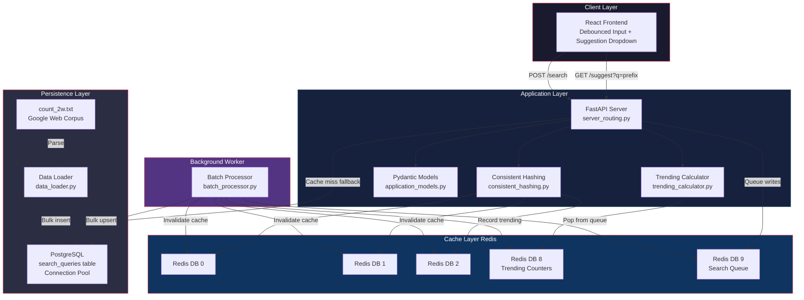
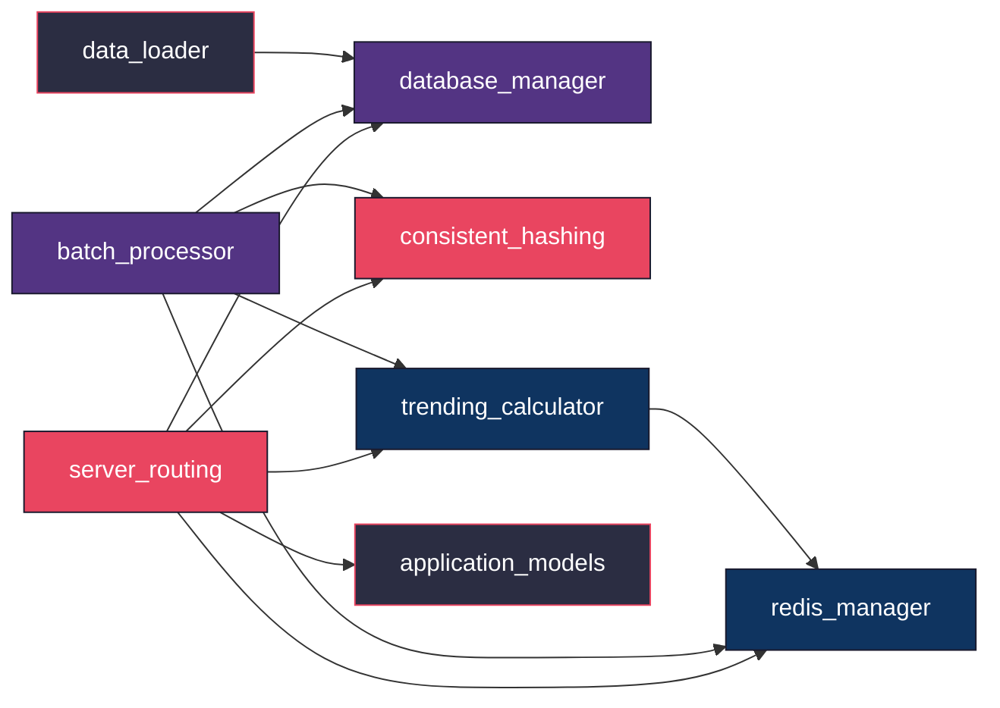
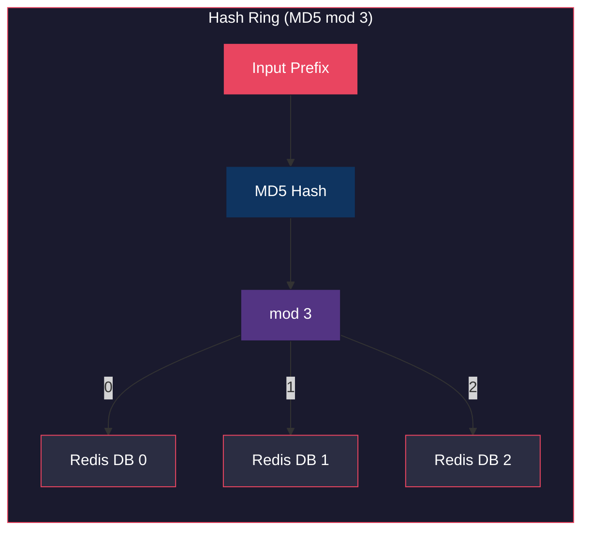
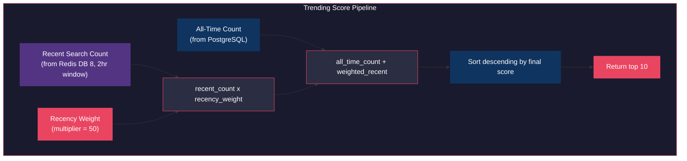
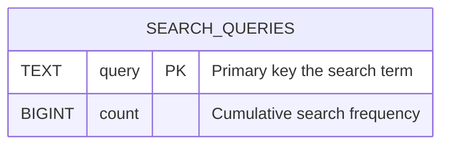
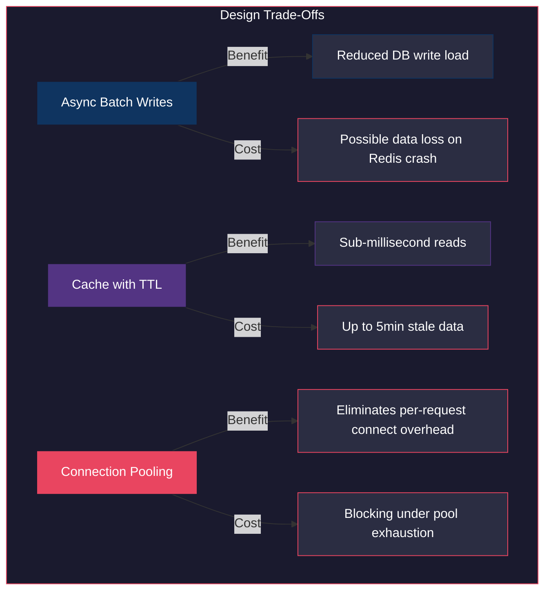
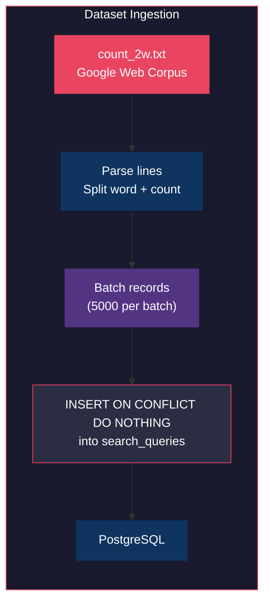

# TypeMAX  System Architecture

---

## 1. Overview

TypeMAX is a prefix-based search typeahead engine designed for low-latency autocomplete. It ingests a large-scale word frequency dataset, serves real-time prefix suggestions, and updates query popularity through an asynchronous batch-write pipeline. The system is built on three infrastructure layers: a FastAPI application server, a Redis caching and queuing tier, and a PostgreSQL persistence layer.

---

## 2. High-Level Architecture



---

## 3. Component Breakdown

### 3.1 File Map

| File | Lines | Role |
|------|-------|------|
| `server_routing.py` | 54 | FastAPI entry point. Exposes all HTTP endpoints. Routes to cache or database. |
| `redis_manager.py` | 42 | Redis connection management. Cache get/set, queue push/pop operations. |
| `database_manager.py` | 74 | PostgreSQL connection pool. Schema init, bulk upsert, prefix query. |
| `consistent_hashing.py` | 6 | MD5-based hash function mapping prefixes to Redis DB indices. |
| `batch_processor.py` | 43 | Background loop. Pops search queue, aggregates, flushes to Postgres. |
| `trending_calculator.py` | 48 | Recency-weighted scoring. Blends all-time count with recent search spikes. |
| `application_models.py` | 16 | Pydantic request/response schemas. |
| `data_loader.py` | 56 | One-time dataset ingestion from Google Web Corpus into PostgreSQL. |

### 3.2 Dependency Graph



---

## 4. Read Path  Suggestion Flow

When a user types a prefix, the system resolves it through cache first, falling back to PostgreSQL on a miss.

```mermaid
sequenceDiagram
    autonumber
    participant C as React Client
    participant S as FastAPI Server
    participant H as Consistent Hashing
    participant R as Redis Cache
    participant T as Trending Calculator
    participant P as PostgreSQL

    rect rgb(26, 26, 46)
        C->>S: GET /suggest?q=ipho
        S->>H: get_assigned_node("ipho")
        H-->>S: node_index = 1
        S->>R: get_cached_suggestions(1, "ipho")
    end

    alt Cache Hit
        rect rgb(15, 52, 96)
            R-->>S: cached suggestions
            S-->>C: JSON array (top 10)
        end
    else Cache Miss
        rect rgb(83, 52, 131)
            R-->>S: None
            S->>P: SELECT query, count WHERE query LIKE 'ipho%' LIMIT 50
            P-->>S: raw results
            S->>T: calculate_trending_suggestions(results)
            T->>R: get recent_search counts
            R-->>T: recency data
            T-->>S: re-ranked results
            S->>R: set_cached_suggestions(1, "ipho", top_10)
            S-->>C: JSON array (top 10)
        end
    end
```



### Read Path Characteristics

| Property | Value |
|----------|-------|
| Cache TTL | 300 seconds (5 minutes) |
| Max results returned | 10 |
| DB fetch limit | 50 (pre-trending re-rank) |
| Hash function | MD5 modulo 3 |
| Index type | B-tree with `text_pattern_ops` |
| Measured p50 latency | 3ms (cached) |
| Measured p95 latency | 28ms |

---

## 5. Write Path  Search Submission Flow

Search submissions are never written synchronously to PostgreSQL. They are queued in Redis and flushed in batches by a background worker.

```mermaid
sequenceDiagram
    autonumber
    participant C as React Client
    participant S as FastAPI Server
    participant Q as Redis Queue (DB 9)
    participant B as Batch Processor
    participant P as PostgreSQL
    participant R as Redis Cache
    participant T as Trending Store (DB 8)

    rect rgb(26, 26, 46)
        C->>S: POST /search { "query": "iphone" }
        S->>Q: RPUSH search_queue "iphone"
        S-->>C: { "message": "Searched" }
    end

    rect rgb(83, 52, 131)
        Note over B: Background loop (every 5 seconds)
        B->>Q: LRANGE + LTRIM (atomic pop up to 50)
        Q-->>B: ["iphone", "iphone", "ipad", ...]
        Note over B: Aggregate duplicates in-memory
        B->>T: record_recent_search for each query
        B->>P: INSERT ON CONFLICT DO UPDATE (bulk)
        Note over B: Compute all prefix substrings
        B->>R: DELETE cached entries for affected prefixes
    end
```



### Write Path Characteristics

| Property | Value |
|----------|-------|
| Queue backend | Redis List (DB 9) |
| Batch size | Up to 50 items per cycle |
| Flush interval | 5 seconds |
| Dedup strategy | In-memory aggregation before DB write |
| Cache invalidation | All prefix substrings of each query |

---

## 6. Consistent Hashing

Prefixes are mapped to one of three logical Redis databases using MD5 hashing. This distributes cache load and demonstrates the distributed cache requirement.



**Properties:**

- Deterministic: the same prefix always maps to the same node.
- Uniform: MD5 provides near-uniform distribution across the three nodes.
- The `/cache/debug` endpoint exposes which node owns a given prefix and whether the lookup was a cache hit or miss.

---

## 7. Trending Score Calculation

Trending rankings blend historical popularity with recency to prevent stale data from permanently dominating results.



**Formula:**

```
Final Score = all_time_count + (recent_count x 50)
```

| Mechanism | Detail |
|-----------|--------|
| Recent window | 2 hours (TTL on Redis keys) |
| Storage | Redis DB 8, sorted set + per-query counters |
| Decay | Keys auto-expire after 7200 seconds |
| Invalidation | Batch processor invalidates cache after flush |

---

## 8. Database Schema



**Index:**

```sql
CREATE INDEX idx_query_prefix
ON search_queries (query text_pattern_ops);
```

The `text_pattern_ops` operator class enables B-tree index usage for `LIKE 'prefix%'` pattern matching, avoiding sequential scans on 100k+ rows.

**Connection Pooling:**

- Pool type: `psycopg2.pool.SimpleConnectionPool`
- Min connections: 2
- Max connections: 10

---

## 9. Redis Database Allocation

| DB Index | Purpose | Data Type |
|----------|---------|-----------|
| 0 | Cache node 0 | String (JSON-serialized suggestions) |
| 1 | Cache node 1 | String (JSON-serialized suggestions) |
| 2 | Cache node 2 | String (JSON-serialized suggestions) |
| 8 | Trending counters | Sorted set + String counters |
| 9 | Search queue | List (FIFO queue) |

---

## 10. Failure Modes and Trade-Offs

### 10.1 Batch Write Durability

The asynchronous write path trades strict durability for reduced database pressure. If Redis crashes before the batch processor flushes the queue, pending search submissions in the Redis List are lost. This is an intentional trade-off: Redis is more durable than a pure in-memory buffer (it supports AOF persistence), and the write reduction benefit outweighs the risk of losing a small number of recent searches.

### 10.2 Cache Staleness Window

Between a search submission and the next batch flush (up to 5 seconds), cached suggestions may not reflect the latest search counts. This is acceptable for a typeahead system where approximate ranking is sufficient.

### 10.3 Connection Pool Exhaustion

Under extreme concurrent load, all 10 pooled connections may be in use. Requests will block until a connection is returned. The pool size is configurable via `MAX_CONNECTIONS`.



---

## 11. Data Ingestion Pipeline



| Property | Value |
|----------|-------|
| Dataset | Peter Norvig's Google Web Trillion Word Corpus (bigrams) |
| File | `count_2w.txt` |
| Batch insert size | 5000 rows per commit |
| Conflict handling | `ON CONFLICT DO NOTHING` (skip duplicates) |
| Pre-ingestion | Truncates table and flushes all Redis databases |

---

## 12. Measured Performance

All metrics captured via a standalone master stress test suite against a live server with the full dataset loaded.

| Metric | Value |
|--------|-------|
| `/suggest` p50 latency (cached) | 3ms |
| `/suggest` p95 latency | 28ms |
| Concurrent `/suggest` (30 parallel) | 30/30 success |
| Concurrent `/search` (30 parallel) | 30/30 success |
| Batch write accuracy | 10/10 exact count |
| Data integrity under load (20 concurrent writes) | 20/20 exact count |
| Cache hit detection | Verified via `/cache/debug` |
| Consistent hash determinism | Same prefix maps to same node across 10 calls |
| Hash distribution | Near-uniform across DB 0, 1, 2 |
| SQL injection resistance | Verified, data intact post-attempt |
| Overall pass rate | 31/31 (100%) |

> **Note:** On Windows, `localhost` resolves to IPv6 (`::1`) first and incurs a ~2 second fallback timeout to IPv4. Use `127.0.0.1` to bypass this. The measured latencies above use direct IPv4.

---
