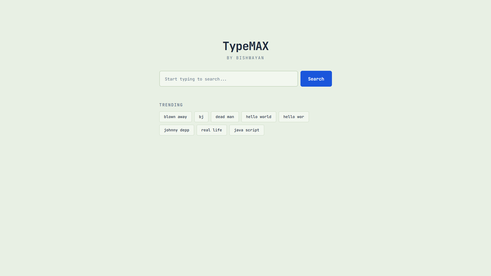
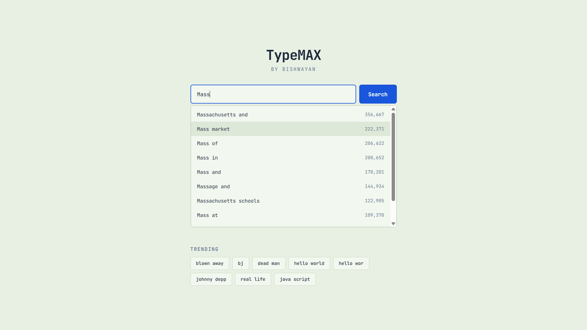

# TypeMAX

A prefix-based search typeahead engine built with FastAPI, Redis, and PostgreSQL. Type a prefix, get instant autocomplete suggestions ranked by popularity and recency.

Built by Bishwayan.

---

## Screenshots

### Landing Page


### Autocomplete in Action


---

## Tech Stack

| Layer | Technology | Purpose |
|-------|-----------|---------|
| Frontend | React + Vite | Debounced search input, suggestion dropdown, trending tags |
| Backend | FastAPI (Python) | REST API serving suggestions, search submissions, trending |
| Cache | Redis | 3-node distributed cache, search queue, trending counters |
| Database | PostgreSQL | Persistent storage for 100k+ query-count pairs |
| Font | JetBrains Mono | Monospaced, clean |

---

## Project Structure

```
TypeMAX/
  backend/
    server_routing.py        # FastAPI routes
    redis_manager.py         # Cache and queue operations
    database_manager.py      # PostgreSQL connection pool and queries
    consistent_hashing.py    # MD5 hash ring for cache distribution
    batch_processor.py       # Async queue-to-database flush loop
    trending_calculator.py   # Recency-weighted suggestion ranking
    application_models.py    # Pydantic request/response schemas
    data_loader.py           # One-time dataset ingestion
  frontend/
    src/
      App.jsx                # Single-component React app
      index.css              # Flat design, creamy green + sharp blue
  Design/
    Architecture.md          # Full system architecture with diagrams
    API.md                   # Detailed API reference with flowcharts
  Report.md                  # Performance report and design trade-offs
```

Each backend file is under 100 lines. No bloat.

---

## Getting Started

### Prerequisites

- Python 3.10+
- Node.js 18+
- PostgreSQL (running locally)
- Redis (running locally)

### 1. Clone

```bash
git clone https://github.com/Bish311/TypeMAX.git
cd TypeMAX
```

### 2. Environment

Copy the example env file and fill in your Postgres password:

```bash
cp .env.example .env
```

`.env.example` contents:

```
POSTGRES_USER=postgres
POSTGRES_PASSWORD=your_password_here
POSTGRES_HOST=localhost
POSTGRES_PORT=5432
POSTGRES_DB=typemax

REDIS_HOST=localhost
REDIS_PORT=6379
```

### 3. Backend

```bash
cd backend

# Create and activate a virtual environment
python -m venv venv
.\venv\Scripts\activate        # Windows
source venv/bin/activate       # Linux/macOS

# Install dependencies
pip install fastapi uvicorn psycopg2-binary redis python-dotenv

# Load the dataset (downloads from Norvig's corpus, bulk inserts into Postgres)
python data_loader.py

# Start the API server
uvicorn server_routing:app --host 0.0.0.0 --port 8765 --reload
```

### 4. Background Worker

In a separate terminal (with the same venv activated):

```bash
cd backend
python batch_processor.py
```

### 5. Frontend

```bash
cd frontend
npm install
npm run dev
```

Open `http://localhost:5173` in your browser.

---

## How It Works

1. **Type a prefix** in the search bar. The frontend debounces input (300ms) and hits `GET /suggest?q=<prefix>`.
2. **Redis cache check.** The prefix is hashed (MD5 mod 3) to one of three Redis databases. If cached, results are returned instantly (~3ms).
3. **Database fallback.** On cache miss, PostgreSQL runs a `LIKE 'prefix%'` query using a `text_pattern_ops` B-tree index, returning the top 50 matches.
4. **Trending re-rank.** Results are re-scored using a formula that blends all-time count with recent search activity, then sliced to top 10.
5. **Submit a search.** Clicking "Search" pushes the query to a Redis queue. A background worker flushes the queue to PostgreSQL every 5 seconds in batch, aggregating duplicates.
6. **Cache invalidation.** After each batch flush, all cached prefixes affected by the new queries are invalidated.

---

## API Endpoints

| Method | Endpoint | Purpose |
|--------|----------|---------|
| `GET` | `/suggest?q=<prefix>` | Autocomplete suggestions (top 10) |
| `POST` | `/search` | Submit a search query |
| `GET` | `/trending` | Recently trending queries |
| `GET` | `/cache/debug?prefix=<prefix>` | Cache hit/miss inspection |

Interactive Swagger docs: `http://127.0.0.1:8765/docs`

---

## Performance

| Metric | Value |
|--------|-------|
| `/suggest` p50 | 3ms |
| `/suggest` p95 | 28ms |
| Concurrent requests (30 parallel) | 100% success |
| Batch write accuracy | Exact count match |
| Stress test pass rate | 31/31 (100%) |

---

## Documentation

| Document | What it covers |
|----------|---------------|
| [Architecture.md](Design/Architecture.md) | System diagrams, read/write paths, consistent hashing, trending algorithm, database schema, failure modes |
| [API.md](Design/API.md) | Per-endpoint flowcharts, request/response schemas, validation rules, error handling, measured latency |
| [Report.md](Report.md) | Design choices (SQL LIKE vs Trie, batch writes, connection pooling), full stress test results, optimization history |

---

## Dataset

Source: [Peter Norvig's Google Web Trillion Word Corpus](https://norvig.com/ngrams/) (bigram frequencies).

The `data_loader.py` script downloads `count_2w.txt` automatically on first run, parses it, and bulk inserts into PostgreSQL in batches of 5,000.

---
