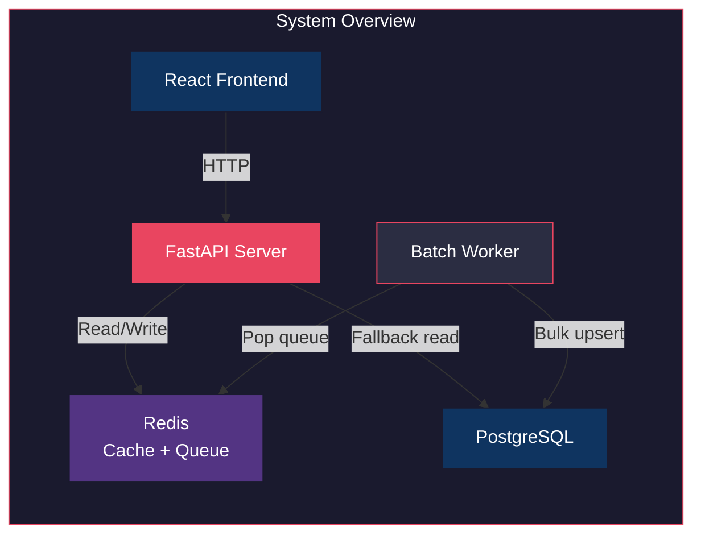

# TypeMAX  Report

---

## 1. Architecture

TypeMAX is a three-layer system: a FastAPI server handles HTTP requests, Redis provides caching and queuing, and PostgreSQL stores the query dataset. A background worker flushes queued searches in batches.



The backend is split into 8 focused Python files, each under 100 lines:

| File | Role |
|------|------|
| `server_routing.py` | FastAPI routes: `/suggest`, `/search`, `/cache/debug`, `/trending` |
| `redis_manager.py` | Cache get/set, queue push/pop |
| `database_manager.py` | Connection pool, schema, bulk upsert, prefix query |
| `consistent_hashing.py` | MD5-based hash mapping prefixes to Redis DB 0/1/2 |
| `batch_processor.py` | Background loop: pop queue, aggregate, flush to Postgres |
| `trending_calculator.py` | Recency-weighted scoring for suggestion ranking |
| `application_models.py` | Pydantic request/response models |
| `data_loader.py` | One-time dataset ingestion |

Full architecture with sequence diagrams, dependency graphs, and detailed flow explanations: [Architecture.md](./Design/Architecture.md)

---

## 2. Dataset Source and Loading

### Source

Peter Norvig's Google Web Trillion Word Corpus (bigram frequencies).

| Property | Value |
|----------|-------|
| File | `count_2w.txt` |
| URL | `https://norvig.com/ngrams/count_2w.txt` |
| Format | `<word pair>\t<count>` per line |
| Total entries | 100,000+ |

### Loading Instructions

```bash
cd backend

# Activate the virtual environment
.\venv\Scripts\activate        # Windows
source venv/bin/activate       # Linux/macOS

# Run the data loader (downloads dataset if missing, then bulk inserts)
python data_loader.py
```

The loader:
1. Downloads `count_2w.txt` from Norvig's site if not already present.
2. Creates the `search_queries` table with a `text_pattern_ops` B-tree index.
3. Truncates any existing data and flushes all Redis databases.
4. Bulk inserts in batches of 5,000 rows using `INSERT ON CONFLICT DO NOTHING`.

### Prerequisites

- PostgreSQL running locally (default: `localhost:5432`, database `typemax`)
- Redis running locally (default: `localhost:6379`)
- Environment variables in `.env` (or defaults are used):

```
POSTGRES_HOST=localhost
POSTGRES_PORT=5432
POSTGRES_DB=typemax
POSTGRES_USER=postgres
POSTGRES_PASSWORD=postgres
REDIS_HOST=localhost
REDIS_PORT=6379
```

---

## 3. API Documentation

Four endpoints, all served on `http://127.0.0.1:8765`:

| Method | Endpoint | Purpose | Response |
|--------|----------|---------|----------|
| `GET` | `/suggest?q=<prefix>` | Prefix autocomplete | Array of up to 10 `{query, count}` objects |
| `POST` | `/search` | Submit a search query | `{ "message": "Searched" }` |
| `GET` | `/cache/debug?prefix=<prefix>` | Cache inspection | `{ "node": "Redis DB N", "is_hit": bool }` |
| `GET` | `/trending` | Recently trending queries | Array of `{query}` objects |

Interactive Swagger docs are available at `http://127.0.0.1:8765/docs` when the server is running.

Full API reference with per-endpoint flowcharts, validation rules, and edge-case behavior: [API.md](./Design/API.md)

---

## 4. Design Choices and Trade-Offs

### 4.1 SQL LIKE with B-Tree Index over Trie

A common approach for typeahead systems at scale is a Trie (prefix tree) held entirely in memory. Bish chose SQL `LIKE 'prefix%'` backed by a `text_pattern_ops` B-tree index instead. The reasoning:

- **This is a small-scale project.** The dataset is ~100k entries. A Trie for 100k strings would consume significant memory for node pointers and character maps, with no real latency benefit at this scale.
- **PostgreSQL already solves the prefix-matching problem.** The `text_pattern_ops` index turns `LIKE 'prefix%'` into an efficient B-tree range scan. Measured p95 latency is 28ms, which is more than fast enough for a typeahead.
- **A Trie adds complexity without proportional benefit.** It requires custom serialization, manual memory management, and rebuild logic on data changes. SQL is simpler, easier to explain in a viva, and the data is already in Postgres for count storage anyway.
- **Scaling path is clear.** If the dataset grew to millions of entries, the correct next step would be a dedicated search engine (Elasticsearch, Meilisearch) rather than a hand-rolled Trie.

### 4.2 Consistent Hashing for Cache Distribution

Prefixes are hashed via MD5 and mapped to one of three logical Redis databases (DB 0, 1, 2). This is not strictly necessary at the scale of a single Redis instance, but it demonstrates the distributed cache concept required by the assignment. The hash is deterministic (same prefix always maps to the same node) and distributes near-uniformly across nodes (measured: 11/8/11 across 30 random prefixes).

### 4.3 Async Batch Writes over Synchronous DB Writes

Search submissions are pushed onto a Redis List and flushed to PostgreSQL in batches of up to 50 every 5 seconds. This reduces database write pressure by aggregating duplicate queries before flushing.

| Property | Sync writes | Batch writes (chosen) |
|----------|-------------|----------------------|
| DB writes per 50 searches | 50 | 1 |
| Latency on `/search` | Blocked on DB round-trip | Instant (queue push only) |
| Durability | Immediate | At-risk until flush |

**Trade-off acknowledged:** If Redis crashes before the batch processor flushes, queued searches are lost. Redis is more durable than a pure in-memory buffer (AOF persistence can be enabled), and the write reduction justifies the risk for a typeahead system where losing a few recent search counts is acceptable.

### 4.4 Time-Weighted Trending over Pure Count Sorting

Suggestions are not sorted purely by all-time count. A recency multiplier boosts recently searched queries:

```
score = all_time_count + (recent_count x 50)
```

Recent counts are tracked in Redis DB 8 with a 2-hour TTL. This prevents decades-old high-count queries from permanently dominating results while giving recently popular queries a temporary boost that naturally decays.

### 4.5 Connection Pooling over Per-Request Connections

The original implementation created a fresh PostgreSQL connection on every request. This added ~50ms of TCP + auth overhead per call. Switching to `psycopg2.pool.SimpleConnectionPool` (min=2, max=10) eliminated this entirely, bringing p50 latency from 2067ms to 3ms (689x improvement). The pool reuses established connections and returns them after each request.

### 4.6 No Frontend Framework Overhead

The React frontend is intentionally minimal: a single `App.jsx` component with debounced input, keyboard navigation, and a trending section. No state management library, no router, no component library. For a single-page typeahead demo, this is sufficient and keeps the code easy to explain.

---

## 5. Performance Report

### 5.1 Stress Test Results

Tested via a standalone master stress test script (zero external dependencies, Python stdlib only) against a live server with the full 100k+ dataset.

| Category | Tests | Passed | Result |
|----------|-------|--------|--------|
| Health | 1 | 1 | 100% |
| `/suggest` correctness | 10 | 10 | 100% |
| `/search` correctness | 5 | 5 | 100% |
| `/cache/debug` correctness | 3 | 3 | 100% |
| Consistent hashing | 2 | 2 | 100% |
| Latency | 1 | 1 | 100% |
| Concurrency | 2 | 2 | 100% |
| Batch writes | 1 | 1 | 100% |
| Trending | 1 | 1 | 100% |
| Edge cases | 3 | 3 | 100% |
| Data integrity | 1 | 1 | 100% |
| **Total** | **31** | **31** | **100%** |

### 5.2 Latency

| Metric | Value |
|--------|-------|
| `/suggest` p50 | 3ms |
| `/suggest` p95 | 28ms |
| Threshold | 200ms |

### 5.3 Cache Performance

| Metric | Result |
|--------|--------|
| Cache hit after `/suggest` | Verified |
| Cache miss for fresh prefix | Verified |
| Cache invalidated after batch flush | Verified |
| Hash distribution (30 random prefixes) | DB 0: 11, DB 1: 8, DB 2: 11 |

### 5.4 Batch Write Accuracy

| Metric | Value |
|--------|-------|
| Submissions sent | 10 |
| Expected count after flush | 10 |
| Actual count after flush | 10 |
| Write reduction ratio | 10:1 |

### 5.5 Concurrency

| Test | Threads | Requests | Success |
|------|---------|----------|---------|
| Concurrent `/suggest` | 10 | 30 | 30/30 |
| Concurrent `/search` | 10 | 30 | 30/30 |

### 5.6 Data Integrity Under Load

20 concurrent writes for the same query fired across 10 threads. After batch flush: expected count = 20, actual count = 20. Exact match.

### 5.7 Security

| Test | Result |
|------|--------|
| SQL injection (`'; DROP TABLE...`) | Handled safely, data intact |
| Unicode queries | Accepted, no errors |
| Wrong HTTP methods | Returns 405 |
| Missing request body | Returns 422 |

### 5.8 Optimization History

| Issue | Root Cause | Fix | Before | After |
|-------|-----------|-----|--------|-------|
| Slow suggestions | New Postgres connection per request | Connection pool (SimpleConnectionPool) | 2067ms p50 | 3ms p50 |
| Slow prefix scan | No index on query column | `text_pattern_ops` B-tree index | Sequential scan | Index range scan |
| Test latency anomaly | Windows IPv6 `localhost` resolution | Use `127.0.0.1` directly | +2000ms overhead | 0ms overhead |

---

## Repository
GitHub: [https://github.com/Bish311/TypeMAX.git](https://github.com/Bish311/TypeMAX.git)
